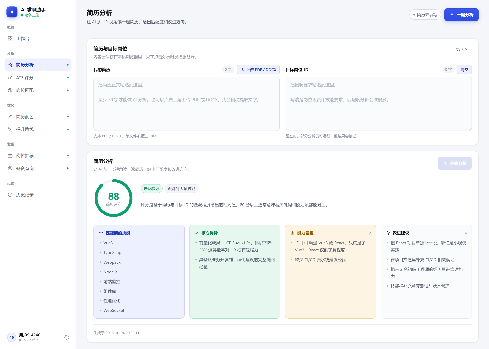
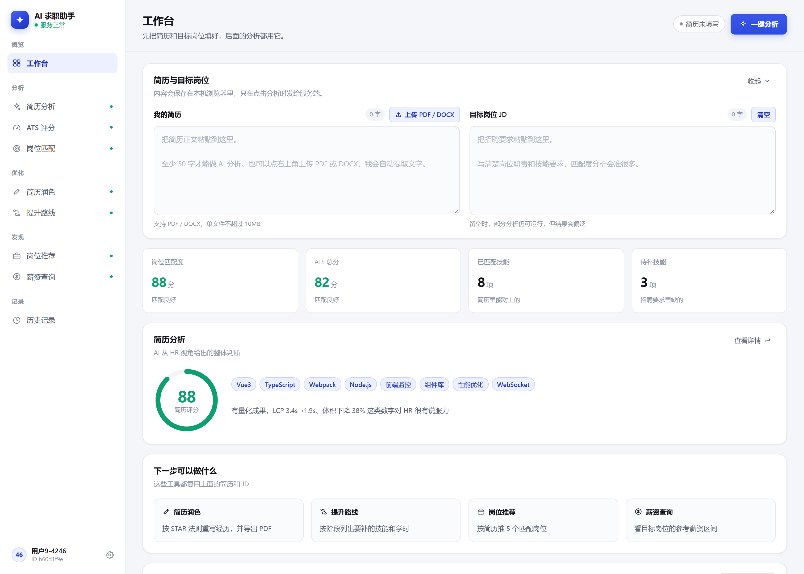
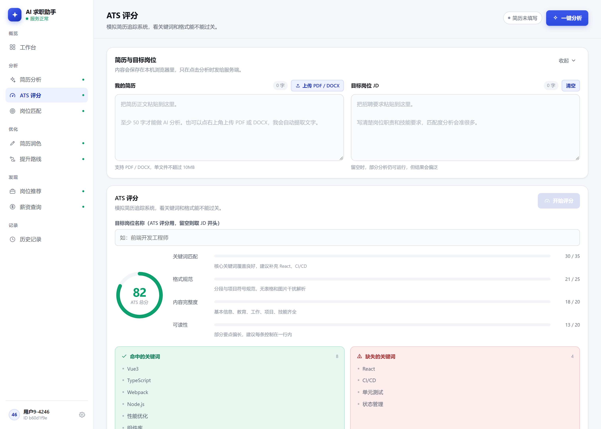
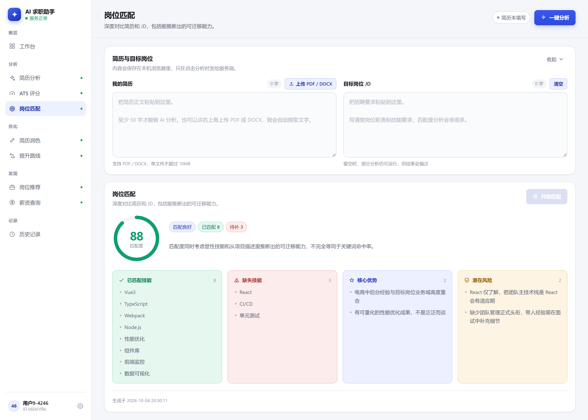
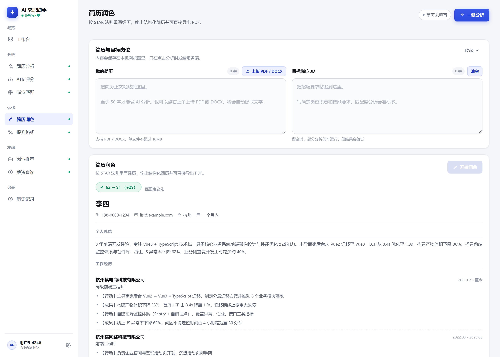
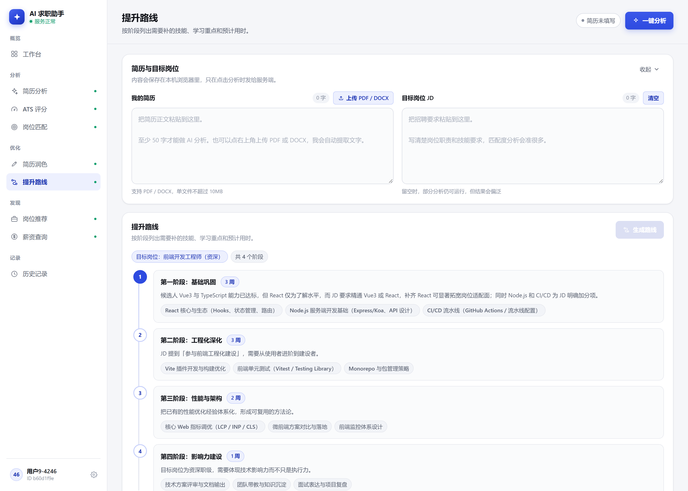
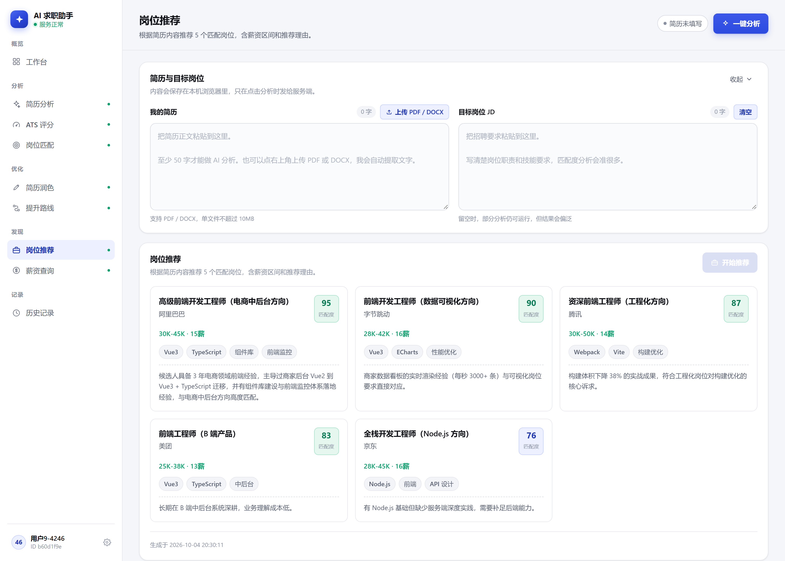
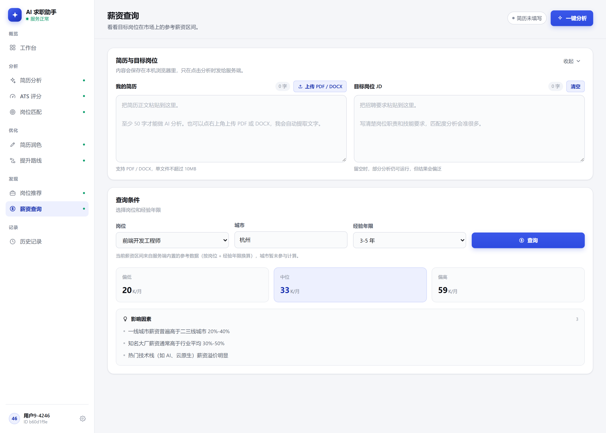
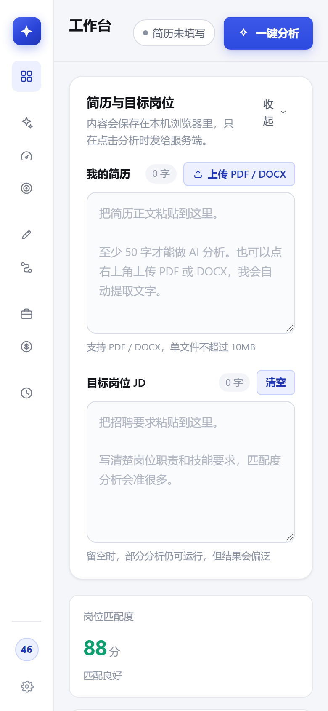

<div align="center">

# 🎯 AI 求职助手 / AI Job Assistant

**简历分析 · ATS 评分 · 岗位匹配 · AI 润色 · 提升路线 —— 一站式求职加速 API，内置网页客户端**

**Resume analysis · ATS scoring · JD matching · AI polishing —— a job-hunting API with a bundled web client**

[](https://nodejs.org)
[](https://expressjs.com)
[](https://www.deepseek.com)
[](https://supabase.com)
[-E63946)](#-功能特性)

**简体中文** ｜ [English](#english)

</div>

<div align="center">
  
</div>

把简历和目标岗位 JD 粘贴进来，AI 会像 HR 一样审阅它：给出匹配度评分、优势与差距、可量化的 ATS 分数、逐条润色建议和技能提升路线 —— 全部通过一套同源部署的 REST API 与网页客户端完成。

> Paste in your resume and a target JD, and the AI reviews it like an HR: match score, strengths & gaps, a quantified ATS score, per-item polishing suggestions and a skill roadmap — all served by a REST API and a same-origin web client.

---

## ✨ 功能特性

| 功能 | 说明 |
|---|---|
| 🚀 工作台一键分析 | 粘贴简历 + JD，一次点击产出分析 / ATS / 匹配三份结果 |
| 🔍 简历分析 | AI 从 HR 视角审阅：匹配度评分、核心优势、能力差距、改进建议 |
| 🎯 ATS 评分 | 机器可读性检查，量化简历通过 ATS 自动筛选的概率 |
| 🧩 岗位匹配 | 简历 × JD 逐项对照，标出命中技能与缺失技能 |
| ✍️ 简历润色 | AI 重写薄弱表述，量化润色前后分值（实测 62 → 91） |
| 🗺️ 提升路线 | 生成 4 阶段技能成长路线图 |
| 💼 岗位推荐 | 基于简历画像推荐适配岗位 |
| 💰 薪资查询 | 按岗位 + 城市给出薪资分位参考（P20 / P50 / P80） |
| 🕘 历史记录 | 所有分析结果持久化留存，可随时回溯 |
| 📄 文件解析 | 上传 PDF / DOCX 自动抽取文本（pdf-parse / mammoth） |
| 📤 PDF 导出 | 生成 ATS 友好的 PDF 简历（PDFKit，ASCII 项目符保证机器可读） |
| 📱 响应式 | 内置网页客户端适配桌面与移动端 |

## 🖼️ 界面预览

| | |
|---|---|
|  |  |
|  |  |
|  |  |
|  |  |

## 🏗️ 技术栈

| 层 | 技术 |
|---|---|
| 运行时 | Node.js（ESM） |
| Web 框架 | Express 4（`trust proxy`、CORS 白名单、2MB JSON 上限） |
| LLM | DeepSeek（OpenAI 兼容 SDK，全端点懒加载客户端） |
| 文件解析 | pdf-parse（PDF）/ mammoth（DOCX） |
| PDF 导出 | PDFKit |
| 存储 | Supabase（可选）→ 未配置时自动降级 JSON 文件存储 |
| 鉴权 | JWT（jsonwebtoken）+ 微信登录（可选，未配置时演示模式） |
| 安全 | express-rate-limit、multer 2.x、`x-powered-by` 关闭 |

## 💡 工程亮点

- **鉴权链路容错** — 部署平台的边缘网关会覆写 `Authorization` 头（实测到达的 token 长度 379 vs 签发的 221）。服务端同时接受 `x-auth-token` / `x-access-token` / `x-token` 备用头，同一客户端零改动即可跨环境运行。
- **AI 输出的渲染健壮性** — LLM 返回的 `skills` 可能是对象而非数组、`experience` 可能是 `items` 数组或 `description` 字符串。PDF 渲染器对全部边界形状做了兼容，并使用 ASCII 项目符保证 ATS 机器可读；导出后经文本抽取回验内容完整性。
- **原子化本地持久化** — JSON 文件存储采用"临时文件 + rename"防止写入撕裂，`SIGTERM` 时 flush 落盘，跨进程重启可用。
- **成本感知限流** — 所有 LLM 端点共享 20 次 / 5 分钟限流并返回可读的 429 JSON，防止匿名循环调用烧掉 API key；登录接口独立限流。
- **零配置可观测** — `/health` 以布尔值报告各可选集成（AI / JWT / Supabase / 微信）的就绪状态，只报状态不泄漏值；配置错误浏览器打开即可定位。
- **同源 SPA** — 内置网页客户端与 API 同域部署：无 CORS 负担、API 路由优先匹配、未知路径回退单页入口（刷新子路由不 404）。

## 🚀 快速开始

```bash
git clone https://github.com/Loki412/ai-job-assistant-server.git
cd ai-job-assistant-server
npm install

# 准备环境变量
cp .env.example .env        # Windows 用: copy .env.example .env
# 编辑 .env：至少填入 DEEPSEEK_API_KEY 与 JWT_SECRET

npm start
```

- 网页客户端：<http://localhost:3000>
- API 索引：<http://localhost:3000/api>
- 健康检查：<http://localhost:3000/health>

## 📡 API 一览

| 方法 | 端点 | 说明 | 鉴权 |
|---|---|---|---|
| POST | `/api/auth/login` | 登录签发 JWT（未配置微信时为演示模式） | — |
| POST | `/api/resume/parse` | 上传 PDF / DOCX 抽取文本 | — |
| POST | `/api/resume/upload` | 上传并保存简历 | ✅ |
| POST | `/api/resume/generate` | AI 生成简历内容 | ✅ |
| POST | `/api/ai/analyze-text` | 简历深度分析（HR 视角） | 可选 |
| POST | `/api/ats/score` | ATS 机器可读性评分 | ✅ |
| POST | `/api/match/analyze` | 简历 × JD 匹配分析 | 可选 |
| POST | `/api/optimize/optimize` | AI 简历润色（量化前后分） | 可选 |
| POST | `/api/roadmap/generate` | 技能提升路线图 | 可选 |
| POST | `/api/compare/analyze` | 多简历对比 | ✅ |
| POST | `/api/recommend/jobs` | 岗位推荐 | ✅ |
| POST | `/api/salary/query` | 薪资分位查询 | ✅ |
| POST | `/api/pdf/resume` | 导出 ATS 友好 PDF 简历 | — |
| GET | `/api/history/list` | 分析历史列表 | ✅ |
| GET | `/health` `/api` | 健康检查 / 服务索引 | — |

> Token 从 `Authorization: Bearer <token>` 读取，部署环境被网关覆写时可改用 `x-auth-token` 备用头。可选鉴权端点匿名可调（受更严限流），带 token 时结果归入个人历史。

## ⚙️ 环境变量

| 变量 | 必填 | 说明 |
|---|---|---|
| `DEEPSEEK_API_KEY` | ✅ | DeepSeek API key，所有 AI 端点依赖 |
| `JWT_SECRET` | ✅（生产） | 用 `node -e "console.log(require('crypto').randomBytes(48).toString('hex'))"` 生成 |
| `PORT` | — | 云平台自动注入，本地默认 3000 |
| `CORS_ORIGIN` | — | 逗号分隔的允许来源；留空允许所有 |
| `SUPABASE_URL` / `SUPABASE_SERVICE_ROLE_KEY` | — | 可选；不配置则使用文件存储（注意：须用 service_role key，本项目用自有 JWT 而非 Supabase Auth） |
| `WX_APPID` / `WX_SECRET` | — | 可选；不配置则登录走演示模式 |
| `DEEPSEEK_BASE_URL` | — | 默认 `https://api.deepseek.com` |

## 📁 项目结构

```
├── app.js                  # Express 入口：路由装配、静态托管、优雅退出
├── routes/                 # 业务路由层（14 个端点）
├── controllers/            # 请求校验与处理
├── services/               # AI 调用 / 双通道存储 / PDF 生成
├── middleware/             # JWT 鉴权（含备用头容错）、限流
├── config/                 # 环境变量懒加载
├── public/                 # 内置网页客户端（同源 SPA）
├── supabase-migration.sql  # 建表 + RLS 策略
└── docs/screenshots/       # README 配图
```

## 🌐 在线演示

> **Demo**: <https://ai-job-assistant-server.app.workbuddy.host/>
>
> 演示实例可能休眠（首次打开需冷启动几秒）或定期重置数据，仅供体验。
> The demo instance may sleep (cold start on first load) or reset periodically. For trial only.

---

<div align="center">

## English

</div>

<div align="center">
  
</div>

Paste in your resume and a target job description, and the AI reviews it like an HR: a match score, strengths & gaps, a quantified ATS score, item-by-item polishing suggestions, and a skill roadmap — all delivered through a REST API and a same-origin web client.

### ✨ Features

| Feature | Description |
|---|---|
| 🚀 One-click workbench | Paste resume + JD, get analysis / ATS / matching results in one shot |
| 🔍 Resume analysis | HR-perspective review: match score, strengths, gaps, improvement advice |
| 🎯 ATS scoring | Machine-readability check that quantifies the odds of passing ATS filters |
| 🧩 JD matching | Item-by-item resume × JD comparison with hit/missing skills |
| ✍️ Resume polishing | AI rewrites weak bullet points, with quantified before/after scores (measured 62 → 91) |
| 🗺️ Skill roadmap | Generates a 4-stage growth roadmap |
| 💼 Job recommendation | Role suggestions based on the resume profile |
| 💰 Salary query | Percentile reference (P20 / P50 / P80) by role + city |
| 🕘 History | Every analysis is persisted and browsable |
| 📄 File parsing | Upload PDF / DOCX and extract text automatically (pdf-parse / mammoth) |
| 📤 PDF export | ATS-friendly PDF resume (PDFKit, ASCII bullets for machine readability) |
| 📱 Responsive | Bundled web client for desktop and mobile |

### 🏗️ Tech Stack

| Layer | Technology |
|---|---|
| Runtime | Node.js (ESM) |
| Web framework | Express 4 (`trust proxy`, CORS whitelist, 2MB JSON cap) |
| LLM | DeepSeek via the OpenAI-compatible SDK (lazy client on every endpoint) |
| File parsing | pdf-parse (PDF) / mammoth (DOCX) |
| PDF export | PDFKit |
| Storage | Supabase (optional) → automatic fallback to a JSON file store |
| Auth | JWT (jsonwebtoken) + WeChat login (optional, demo mode when unset) |
| Security | express-rate-limit, multer 2.x, `x-powered-by` disabled |

### 💡 Engineering Notes

- **Auth-header resilience** — the hosting platform's edge gateway overwrites the `Authorization` header (token arrived 379 chars vs. 221 issued). The server also accepts `x-auth-token` / `x-access-token` / `x-token` backup headers, so the same client runs unchanged across environments.
- **Rendering robustness for LLM output** — the model may return `skills` as an object instead of an array, or `experience` as `items` arrays vs. `description` strings. The PDF renderer handles every observed shape, uses ASCII bullets for ATS safety, and output is verified by text extraction after export.
- **Atomic local persistence** — the JSON file store writes via temp-file + rename to prevent torn writes, flushes on `SIGTERM`, and survives process restarts.
- **Cost-aware rate limiting** — every LLM endpoint shares a 20 req / 5 min limiter that returns a readable 429 JSON, protecting the API key from anonymous loops; login has its own limiter.
- **Zero-config observability** — `/health` reports readiness of each optional integration (AI / JWT / Supabase / WeChat) as booleans only, never leaking values; a misconfigured deploy is diagnosable straight from the browser.
- **Same-origin SPA** — the bundled web client is served from the same domain as the API: no CORS overhead, API routes matched first, and unknown paths fall back to the SPA entry (no 404 on refresh).

### 🚀 Quick Start

```bash
git clone https://github.com/Loki412/ai-job-assistant-server.git
cd ai-job-assistant-server
npm install

cp .env.example .env   # then fill in DEEPSEEK_API_KEY and JWT_SECRET

npm start
```

- Web client: <http://localhost:3000>
- API index: <http://localhost:3000/api>
- Health check: <http://localhost:3000/health>

### 📡 API Overview

| Method | Endpoint | Description | Auth |
|---|---|---|---|
| POST | `/api/auth/login` | Login, issues a JWT (demo mode without WeChat config) | — |
| POST | `/api/resume/parse` | Upload PDF / DOCX and extract text | — |
| POST | `/api/resume/upload` | Upload & save a resume | ✅ |
| POST | `/api/resume/generate` | AI-generate resume content | ✅ |
| POST | `/api/ai/analyze-text` | Deep resume analysis (HR perspective) | optional |
| POST | `/api/ats/score` | ATS machine-readability score | ✅ |
| POST | `/api/match/analyze` | Resume × JD match analysis | optional |
| POST | `/api/optimize/optimize` | AI resume polishing with before/after scores | optional |
| POST | `/api/roadmap/generate` | Skill growth roadmap | optional |
| POST | `/api/compare/analyze` | Multi-resume comparison | ✅ |
| POST | `/api/recommend/jobs` | Job recommendation | ✅ |
| POST | `/api/salary/query` | Salary percentile query | ✅ |
| POST | `/api/pdf/resume` | Export an ATS-friendly PDF resume | — |
| GET | `/api/history/list` | Analysis history | ✅ |
| GET | `/health` `/api` | Health check / service index | — |

> Tokens are read from `Authorization: Bearer <token>`; on hosts where the gateway rewrites it, the `x-auth-token` backup header is accepted. Optional-auth endpoints work anonymously (with stricter rate limits); passing a token files results into personal history.

### ⚙️ Environment Variables

| Variable | Required | Description |
|---|---|---|
| `DEEPSEEK_API_KEY` | ✅ | DeepSeek API key; required by all AI endpoints |
| `JWT_SECRET` | ✅ (prod) | Generate via `node -e "console.log(require('crypto').randomBytes(48).toString('hex'))"` |
| `PORT` | — | Injected by cloud platforms; defaults to 3000 locally |
| `CORS_ORIGIN` | — | Comma-separated allowed origins; empty = allow all |
| `SUPABASE_URL` / `SUPABASE_SERVICE_ROLE_KEY` | — | Optional; file store is used when unset (must be the service_role key — this server uses its own JWT, not Supabase Auth) |
| `WX_APPID` / `WX_SECRET` | — | Optional; login runs in demo mode when unset |
| `DEEPSEEK_BASE_URL` | — | Defaults to `https://api.deepseek.com` |

### 🌐 Live Demo

> **Demo**: <https://ai-job-assistant-server.app.workbuddy.host/>
>
> The demo instance may sleep (cold start on first load) or reset periodically. For trial only.

</div>
